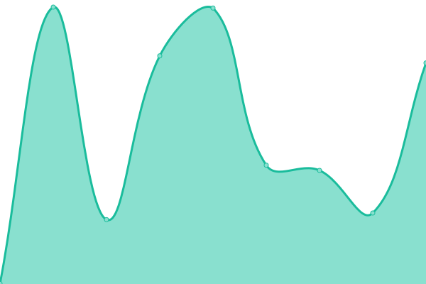

# [📈 Live Status](https://uptime.thenoton.com): <!--live status--> **🟩 All systems operational**

This repository contains the open-source uptime monitor and status page for Team NOTON, powered by [Upptime](https://github.com/upptime/upptime).

<!--start: status pages-->
<!-- This summary is generated by Upptime (https://github.com/upptime/upptime) -->
<!-- Do not edit this manually, your changes will be overwritten -->
<!-- prettier-ignore -->
| URL | Status | History | Response Time | Uptime |
| --- | ------ | ------- | ------------- | ------ |
|  Authelia | 🟩 Up | [authelia.yml](https://github.com/sannidhyaroy/Uptime-Ryuu/commits/HEAD/history/authelia.yml) | 

 837ms
     
 | 

<a href="https://uptime.thenoton.com/history/authelia">100.00%</a>
    

|  Immich | 🟩 Up | [immich.yml](https://github.com/sannidhyaroy/Uptime-Ryuu/commits/HEAD/history/immich.yml) | 

 1674ms
     
 | 

<a href="https://uptime.thenoton.com/history/immich">100.00%</a>
    

|  Jellyseerr | 🟩 Up | [jellyseerr.yml](https://github.com/sannidhyaroy/Uptime-Ryuu/commits/HEAD/history/jellyseerr.yml) | 

 3113ms
     
 | 

<a href="https://uptime.thenoton.com/history/jellyseerr">100.00%</a>
    

|  Komga | 🟩 Up | [komga.yml](https://github.com/sannidhyaroy/Uptime-Ryuu/commits/HEAD/history/komga.yml) | 

 1652ms
     
 | 

<a href="https://uptime.thenoton.com/history/komga">100.00%</a>
    

|  Nextcloud | 🟩 Up | [nextcloud.yml](https://github.com/sannidhyaroy/Uptime-Ryuu/commits/HEAD/history/nextcloud.yml) | 

 2709ms
     
 | 

<a href="https://uptime.thenoton.com/history/nextcloud">100.00%</a>
    

|  Paperless | 🟩 Up | [paperless.yml](https://github.com/sannidhyaroy/Uptime-Ryuu/commits/HEAD/history/paperless.yml) | 

 2175ms
     
 | 

<a href="https://uptime.thenoton.com/history/paperless">100.00%</a>
    

|  Soduto | 🟩 Up | [soduto.yml](https://github.com/sannidhyaroy/Uptime-Ryuu/commits/HEAD/history/soduto.yml) | 

 354ms
     
 | 

<a href="https://uptime.thenoton.com/history/soduto">100.00%</a>
    

|  Vaultwarden | 🟩 Up | [vaultwarden.yml](https://github.com/sannidhyaroy/Uptime-Ryuu/commits/HEAD/history/vaultwarden.yml) | 

 799ms
     
 | 

<a href="https://uptime.thenoton.com/history/vaultwarden">100.00%</a>
    

|  Velocity Search | 🟩 Up | [velocity-search.yml](https://github.com/sannidhyaroy/Uptime-Ryuu/commits/HEAD/history/velocity-search.yml) | 

 1493ms
     
 | 

<a href="https://uptime.thenoton.com/history/velocity-search">100.00%</a>
    

<!--end: status pages-->

[**Visit our status website →**](https://uptime.thenoton.com)

## 📄 License

- Powered by: [Upptime](https://github.com/upptime/upptime)
- Code: [MIT](./LICENSE) © [Anand Chowdhary](https://anandchowdhary.com), supported by [Pabio](https://pabio.com)
- Data in the `./history` directory: [Open Database License](https://opendatacommons.org/licenses/odbl/1-0/)
